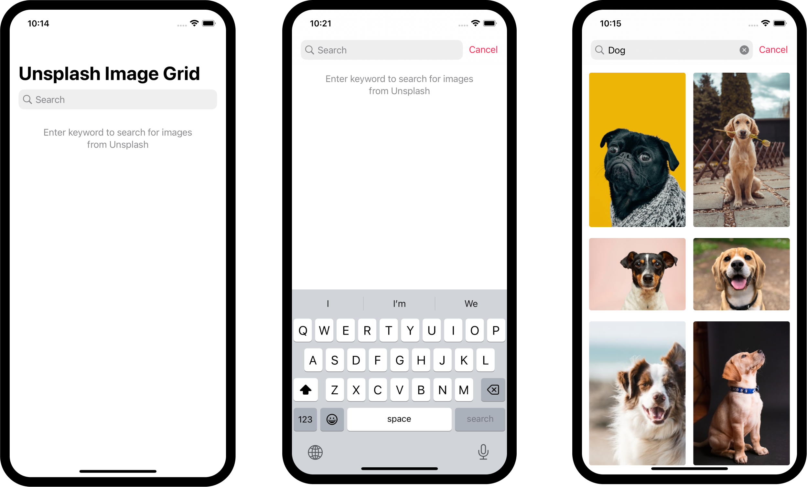

# Unsplash Image Grid App

Simple single scene application that is connected to the [Unsplash API](https://unsplash.com/developers) and presents the search results in a grid. 

## Setup
The API key configuration is setup as described [here](https://sentry.io/answers/environment-variables-swiftui/) and the API key needs to be added in the `Config.xcconfig` file to test the app.

## Note
- As mentioned in the [Unsplash API documentation](https://unsplash.com/documentation#blurhash-placeholders), Unsplash uses BlurHash Placeholders. Therefore, the code in `Unsplash/Utils/BlurHashDecode.swift` is taken from [Wolt](https://github.com/woltapp/blurhash) to decode the BlurHash.
- This is only simple implementation based on a coding assignment, therefore some aspects such as testing, accessibility or landscape mode are not explicitly supported.

## Preview 
 

    Screenshots of Unsplash Image Grid App

 
